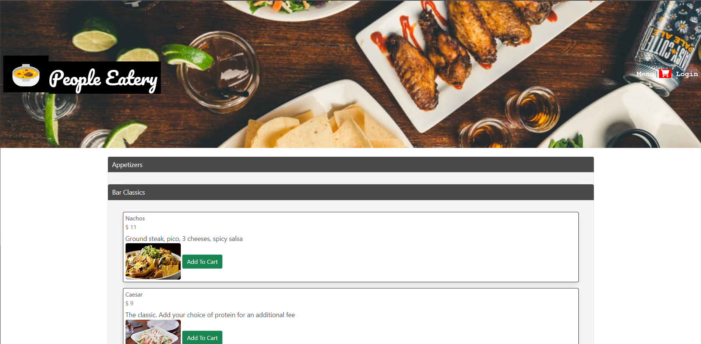

# The People Eatery
People Eatery is a virtual menu application which would help users with view the menu, place the order. It provides the additional capability of order updation and deletion based on user privileges. This application has two user personas where an User as restaurent ower can login, place orders for guests as per Table Number, update the order status as when delivered and delete the order which couldn't be served other as Geast who can view menu and place the order.

Application uses Node.js, Express.js, Handlebars.js, Bulma Extensions (Accordian), Authetication module with session, Axios (Third party Api call from Node) with API keys and config in .env file. Also the application is deployed using Heroku.

Features of the application includes
* On the application load, Menu Items list with category accordians is displayed with the navigations options(Menu|Cart|Order|Login) at the Top right corner.
* On click of Login option, owner is prompted to login to the application, if not can sign up and login.
* User can add the menu items to the cart by clicking Add to Cart button on Menu item.
* On click of Cart Icon on the Navigation bar, menuitems gets added to cart and will navigate to the cart page.
* User will be able to manipulate the cart by changing the quantity and total price of the items in the cart will be displayed.
* On click of Order button on Cart page, order will be placed in the data base against the entered table number.
* As logged in Owner, on clicking the Order link in the navigation bar, user is navigated to Orders page.
* On the Orders page load, all orders  from the database are displayed.
* As when the ordered item is delivered to the guest, the Order can be updated with order item status.
* Also there is facility to delete order by the Owner.
* The site is also responsive for the guest user to scan QR code and view the digital menu on mobile screen.

## Mock-Up

The following image is the application screen shot:

## Application Deployed Url

Below is link for application deployed using Heroku

[The People Eatery](https://people-eatery.herokuapp.com/)

